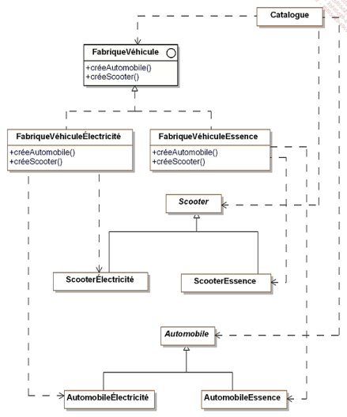
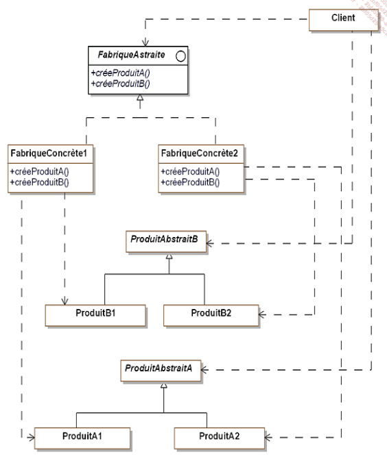
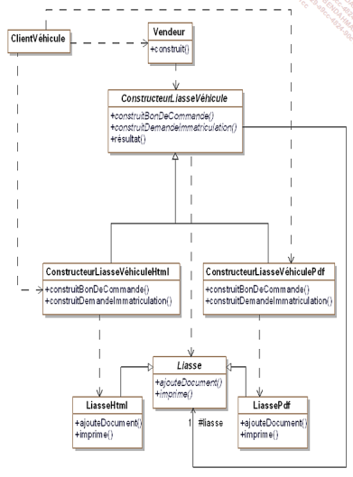
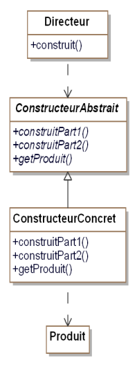
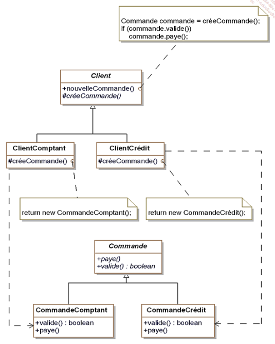
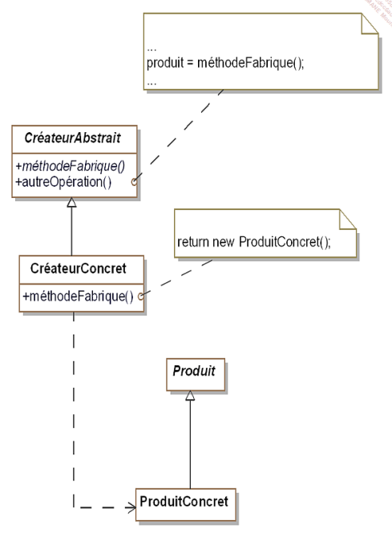
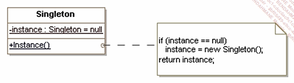
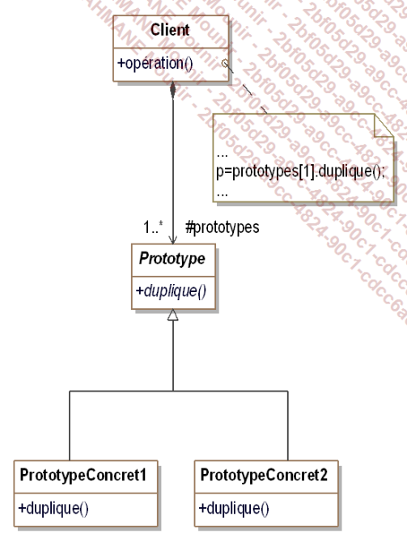

Cours de design pattern
=======================
Sommaire : 
- [Cours de design pattern](#cours-de-design-pattern)
- [Notation](#notation)
- [Définition](#définition)
- [Les design patterns](#les-design-patterns)
  - [Les Patterns de construction](#les-patterns-de-construction)
    - [Abstract factory](#abstract-factory)
      - [Quelques rappels](#quelques-rappels)
    - [Pattern builder](#pattern-builder)
    - [Factory method](#factory-method)
<br>

# Notation
- A rendre
  - Projet applis console avec les design patterns appris
  - QCM

Slide avec résumé a la fin

# Définition
- Ce sont des schémas d'objets qui permettent de trouver une solution à un problème courrant
- Il srépondent a un problème de conception POO
- Ils résultent de méthodes de bonne pratiques en POO

# Les design patterns
Il existe 23 patterns principaux
## Les Patterns de construction

### Abstract factory


Au lieu de créer une classe mère __``Catalogue``__ surchargée de fonctions
A chaque fois qu'une nouvelle famille de vehicule est prise en compte

On utilise le design pattern __``Abstract Factory``__ 
Le but du pattern est de résoudre tous les problèmes liés a la création de classes et au fait de surcharger la classe parente

Création d'une fabrique de vehicule en créant une interface qui contient les signatures des fonctions

Signature d'une fonction ~= prototype en c++

Description de __``Scooter``__ :
- Un ``Scooter`` peut être un electrique ou essence
- Un ``ScooterElectricite`` est créé par la ``FabriqueVehiculeElectricite``
- Un ``ScooterEssence`` est créé par la ``FabriqueVehiculeEssence``

Une interface n'est qu'un comportement
Une classe abstraite avec des methodes sans implémnetations.
Le catalogue peut créer des vehicules peu importe son type


Diagramme + générique :


#### Quelques rappels
Une classe abstraite n'est pas isntanciable
Les attributs peuvent être :
- public (accessible de partout)
- private (accessible uniquement dans la classe)
- protected (accessible dans la classe et dans les classes filles)

```c#
public interface FabriqueVehicule{
   Automobile creerAutomobile(string modele, string couleur, int puissance, double espace);
}

public class FabriqueAutomobileELectrique : FabriqueVehicule{
   public Automobile creerAutomobile(string modele, string couleur, int puissance, double espace)
   {
      return new AutomobileElectrique(modele, couleur, puissance, espace);
   }
}
```
Voir exemple complet ici dans ``project_example/design_pattern_1/``

### Pattern builder

Le but du pattern builder est de créer un document sans connaitre le type de celui-ci

Peu importe l'implementatition des instances le client va dialoguer qu'avec le builder de base

Le but de ce design pattern est de séparer la logique type de la logique de création d'une liasse de document

Pourquoi ? Car logique métier redondant, le pattern sert a mettre un nom sur la logique "Je veux créer un document"

Exemple concret :

Diagramme + générique : 



### Factory method


Exemple concret :



__``Commande``__ est une classe abstraite qui liste les elements géneriques a une commande quelles qu'elles soient

Diagramme + générique :



### Singleton

Permet d'avoir 1 seule instance d'une classe

Notre application va utiliser la classe liasse vierge (LiasseVierge) qui ne possedera qu'une seule instance




### Prototype

Le pattern prototype permet la création d'objets à partir d'autres objets appelés "prototypes" disposan d'une méthode Clone() qui retourne un objet identique



### Adapter

## EXERCICE
### Composition vs Héritage en c#

La composition signifie que la classe mere est composée de plusieurs autres classes. Celles ci ne sont pas dependantes de la classe mere

L'heritage signifie que la classe fille est une précision de la classe mère. La classe fille ne peut pas vivre sans la classe mere

Exemple : 
- Composition : Une voiture est composée d'un moteur, de roues. Une roue peut ne pas avoir de voiture. La classe mere n'est pas obligatoire
- Héritage : La classe marque hérite de la classe voiture. Une ``Renault`` EST une voiture. La classe marque ne peut pas vivre sans une voiture.
