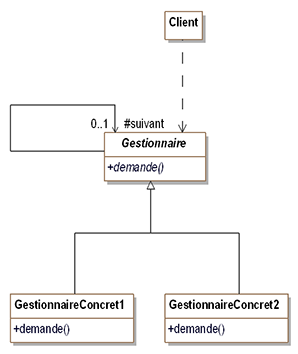

Cours de design pattern
=======================
Sommaire : 
- [Cours de design pattern](#cours-de-design-pattern)
- [Notation](#notation)
- [Définition](#définition)
- [Les design patterns](#les-design-patterns)
  - [Les Patterns de construction](#les-patterns-de-construction)
    - [Abstract factory](#abstract-factory)
      - [Quelques rappels](#quelques-rappels)
    - [Pattern builder](#pattern-builder)
    - [Factory method](#factory-method)
    - [Singleton](#singleton)
    - [Prototype](#prototype)
  - [Les Patterns de structuration](#les-patterns-de-structuration)
    - [Adapter](#adapter)
    - [Bridge](#bridge)
    - [Composite](#composite)
    - [Decorator](#decorator)
  - [Les Patterns de comportement](#les-patterns-de-comportement)
    - [Chain of responsability](#chain-of-responsability)
    - [Command](#command)
  - [EXERCICES](#exercices)
    - [Composition vs Héritage en c#](#composition-vs-héritage-en-c)
<br>

# Notation
- A rendre
  - Projet applis console avec les design patterns appris
  - QCM

Slide avec résumé a la fin

# Définition
- Ce sont des schémas d'objets qui permettent de trouver une solution à un problème courrant
- Il srépondent a un problème de conception POO
- Ils résultent de méthodes de bonne pratiques en POO

# Les design patterns
Il existe 23 patterns principaux
## Les Patterns de construction

### Abstract factory


Au lieu de créer une classe mère __``Catalogue``__ surchargée de fonctions
A chaque fois qu'une nouvelle famille de vehicule est prise en compte

On utilise le design pattern __``Abstract Factory``__ 
Le but du pattern est de résoudre tous les problèmes liés a la création de classes et au fait de surcharger la classe parente

Création d'une fabrique de vehicule en créant une interface qui contient les signatures des fonctions

Signature d'une fonction ~= prototype en c++

Description de __``Scooter``__ :
- Un ``Scooter`` peut être un electrique ou essence
- Un ``ScooterElectricite`` est créé par la ``FabriqueVehiculeElectricite``
- Un ``ScooterEssence`` est créé par la ``FabriqueVehiculeEssence``

Une interface n'est qu'un comportement
Une classe abstraite avec des methodes sans implémnetations.
Le catalogue peut créer des vehicules peu importe son type


Diagramme + générique :


#### Quelques rappels
Une classe abstraite n'est pas isntanciable
Les attributs peuvent être :
- public (accessible de partout)
- private (accessible uniquement dans la classe)
- protected (accessible dans la classe et dans les classes filles)

```c#
public interface FabriqueVehicule{
   Automobile creerAutomobile(string modele, string couleur, int puissance, double espace);
}

public class FabriqueAutomobileELectrique : FabriqueVehicule{
   public Automobile creerAutomobile(string modele, string couleur, int puissance, double espace)
   {
      return new AutomobileElectrique(modele, couleur, puissance, espace);
   }
}
```
Voir exemple complet ici dans ``project_example/design_pattern_1/``

### Pattern builder

Le but du pattern builder est de créer un document sans connaitre le type de celui-ci

Peu importe l'implementatition des instances le client va dialoguer qu'avec le builder de base

Le but de ce design pattern est de séparer la logique type de la logique de création d'une liasse de document

Pourquoi ? Car logique métier redondant, le pattern sert a mettre un nom sur la logique "Je veux créer un document"

Exemple concret :


Diagramme + générique :


### Factory method


Exemple concret :


__``Commande``__ est une classe abstraite qui liste les elements géneriques a une commande quelles qu'elles soient

Diagramme + générique :


### Singleton

Permet d'avoir 1 seule instance d'une classe

Notre application va utiliser la classe liasse vierge (LiasseVierge) qui ne possedera qu'une seule instance


### Prototype

Le pattern prototype permet la création d'objets à partir d'autres objets appelés ``prototypes`` disposant d'une méthode Clone() qui retourne un objet identique


## Les Patterns de structuration

### Adapter
Le but de ce pattern est de ``convertir`` l'``interface`` c'une classe donnée en une ``interface`` ``attendue`` par des clients afin qu'il s puissent travailler ensembles.
En résumer, il permet de donner à une classe existante une nouvelle interface pour répondre aux besoins d'un client.


``DocumentHtml`` hérite de ``Document``

``DocumentPdf`` hérite de ``Document`` et est composé de un ou plusieurs ``ComposantsPdf``

Dans ce cas, la classe ``DocumentPdf`` adapte ``ComposantPdf``

### Bridge


Diagramme + générique


Le pattern ``Bridge`` est utilisé pour séparer le compretement de l'implémentation de l'``interface`` et de l'implémentation de l'``objet``

Exemple :

On s'intéresse aux demandes d'immatriculation des véhicules. Le formulaire de demande d'immatriculation possède deux implémentations différentes :
- FormulaireImmat
- FormulaireImmatHTML
- FormulaireImmatAPP

Au départ le système a été conçu pour la France uniquement. Ensuite on a du créer une sous-classe de FormulaireImmatCH (suisse)
Elle aussi est abstraite pour avoir également deux sous-classes concrètes (qui sont FormulaireImmatHTML et FormulaireImmatAPP dédiées à la suisse)


### Composite


Diagramme + générique


Ce pattern offre un cadre de conception d'une composition d'objet dont on ne connait pas la profondeur. (On peut utiliser un arbre en tant qu'analogie)

Les "clients" interagissent avec les objets sans connaitre la structure de l'arbre

### Decorator

Ce pattern permet d'ajouter ``Dynamiquement`` les fonctionnalitées ``Suplémentaires`` à un objet sans modifier l'interface de l'objet ("Les lients de l'objet ne sont pas su courant de la modification")

Il s'agit d'une alternative à la création d'une sous-classe qui permettrait d'enrichir l'objet

## Les Patterns de comportement

Les patterns de comportement distribuent les algorithmes/traitements entre les objets
Ils organisent les interactions en renseignant le "flux de controle" et de traitement au sein d'un système d'objets

La distribution se fait soit par ``héritage`` soit par ``délégation``

### Chain of responsability


Plus générique





Le but est de construire une chaine d'objets de manière a ce que si un objet de la chaine ne peut répondre à une requête, il puisse la passerà un ``successeur`` et ainsi de suite jusqu'à ce que l'un des objest puissent y répondre

### Command

Ce pattern transforme une requête en objet. Ceci facilite les opérations relatives à la requête ex: Annulation, queue, suivi, etc...


## EXERCICES
### Composition vs Héritage en c#

La ``composition`` signifie que la classe mere est ``composée`` de plusieurs autres classes. Celles ci ne sont ``pas dependantes`` de la classe ``mere``

L'``heritage`` signifie que la classe fille est une ``précision`` de la classe mère. La classe fille ``ne peut pas ``vivre sans la classe mere

Exemple : 
- ``Composition`` : Une voiture est composée d'un moteur, de roues. Une roue peut ne pas avoir de voiture. La classe mere n'est pas obligatoire
- ``Héritage`` : La classe marque hérite de la classe voiture. Une ``Renault`` EST une voiture. La classe marque ne peut pas vivre sans une voiture.
